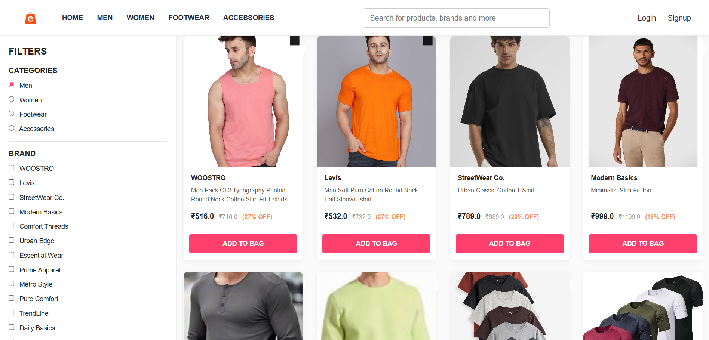
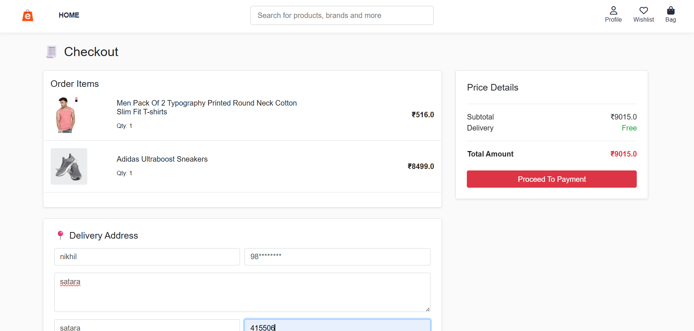
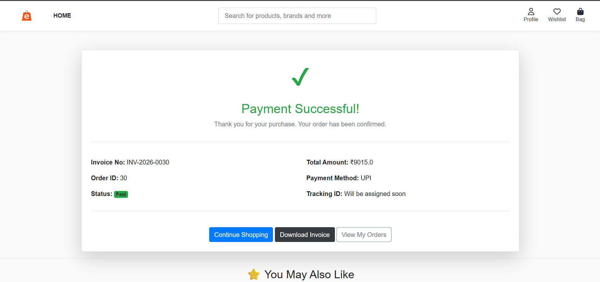
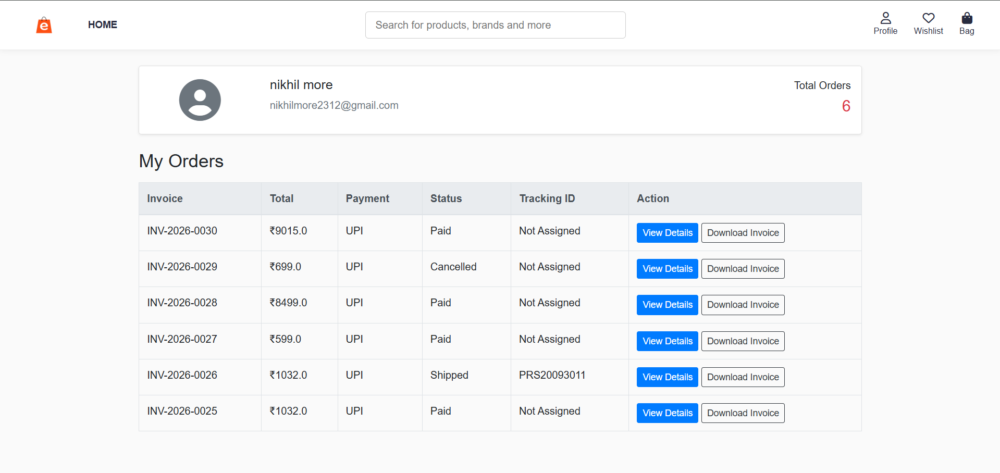

# My-Flask-Personalized-Shopping-System


## 📌 Description

हा एक Flask आधारित E-commerce web application आहे ज्यामध्ये user ला products पाहता येतात, cart मध्ये add करता येतात आणि AI आधारित recommendation system वापरून similar products दाखवले जातात.
## 🚀 Features

- 🛍️ Product Listing & Details
- 🛒 Add to Cart & Checkout
- 💳 Razorpay Payment Integration
- 📧 Email Notification
- 🤖 AI Recommendation System
- ❤️ Wishlist
- ⭐ Ratings & Reviews
- 👨‍💼 Admin Panel
## 🛠️ Tech Stack

- Backend: Flask (Python)
- Database: MySQL / SQLite
- Frontend: HTML, CSS, Bootstrap
- ORM: SQLAlchemy
- Payment: Razorpay
- Email: Flask-Mail
- ML: TF-IDF + Cosine Similarity
## 📸 Screenshots

### 🏠 Home Page


### 🛍️ Product Page


### 🛒 Cart Page


### 💳 Checkout Page


### 💳 user_ordr Page


## ⚙️ Installation

```bash
git clone https://github.com/pratik-takale/My-Personalized-shopping-system.git
cd My-Personalized-shopping-system
pip install -r requirements.txt
python app.py
